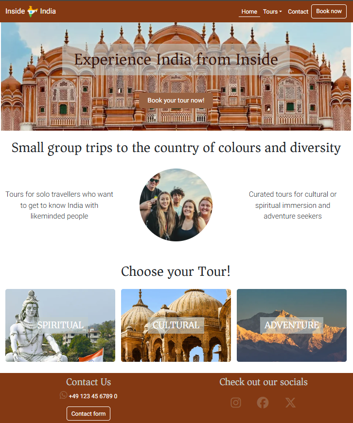
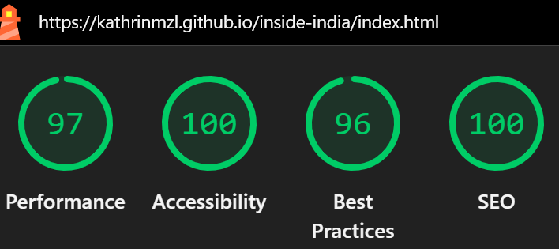
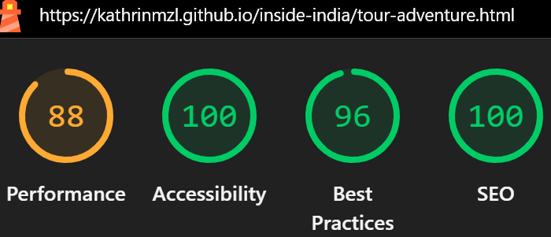

# Inside India

“Inside India” is a fictional travel website targeting solo travellers who want to travel around India with a small group of likeminded travellers. The website primarily wants to sell curated tour packages. As a visitor I want to find information on available tours and have access to a booking form.

The website was created for educational purposes only.

[Live page on Github Pages](https://kathrinmzl.github.io/inside-india/)

## CONTENT

* [User Experience (UX)](#User-Experience-(UX))
  * [Site Goals](#Site-Goals)
  * [User Stories](#User-Stories)
  * [Features to achieve the goals](#Features-to-achieve-the-goals)

* [Design](#Design)
  * [Wireframes](#Wireframes)
  * [Colour Scheme](#Colour-Scheme)
  * [Typography](#Typography)
  * [Imagery](#Imagery)
  * [Features](#Features)

* [Future Features](#Future-Features)

* [Testing](#Testing)
  * [Manual Testing](#Manual-Testing)
  * [Code Validation](#Code-Validation)
  * [Lighthouse](#Lighthouse)
  * [User Story Testing](#User-Story-Testing)
  * [Known Bugs](#Known-Bugs)
  
* [Technologies Used](#Technologies-Used)
  * [Languages Used](#Languages-Used)
  * [Frameworks, Libraries & Programs Used](#Frameworks,-Libraries-&-Programs-Used)

* [Deployment & Local Development](#Deployment-&-Local-Development)
  * [Deployment](#Deployment)
  * [Local Development](#Local-Development)

* [Credits](#Credits)
  * [Code Used](#Code-Used)
  * [Content](#Content)
  * [Media](#Media)

- - -

## User Experience (UX)

### Site Goals

- Business Goals: Sell tour packages
- Users’ needs: Get information on available tours, access to booking form
- Primary user: Solo traveller looking to book a trip with a small group of likeminded travellers

### User Stories
#### Must-have
1. As a visitor, I want to easily understand the main purpose of the site
2. As a visitor, I want to be able to easily navigate throughout the site to find content 
3. As a solo traveller I want to view detailed information about the trips’ itineraries, dates and costs of each tour so that I can decide if i want to join 
4. As a solo traveller I want to register for tours online so that I can reserve my spot 
#### Should-have
5. As a solo traveller I want to be able to contact the tour operator in case I need further information
#### Could-have
6. As a solo traveller I want to read testimonials from previous attendees so that I can feel confident about attending a tour
7. As a solo traveller I want to receive news on upcoming tours so that I can secure my spot in time

### Features to achieve the goals
- The website will be built with a mobile-first approach, to ensure it is responsive. It will be tested on various devices and screen sizes
- The home page will include a section showcasing that it is a website for small curated group tours through India
- The home page will include a section with a preview of available tours
- For each tour package there will be a separate page displaying detailed information about the trips’ itineraries, the costs of each tour and a gallery
- On each tours’ page there will be a call-to-action button to book the tour online
- There will be a separate page with a form to book a tour
- There will be a contact form to contact the tour operator
- In the navbar you will find links to the tour pages as well as the contact and booking form
- In the footer there will be links to socials and a Whatsapp number
- On the home page there will be a section displaying testimonials from previous attendees (could-have)
- There will be a signup link for a newsletter to receive news on upcoming tours (could-have)
    

- - -

## Design

### Wireframes

As the website follows a mobile-first approach, wireframes were created for mobile screens as well as larger screens like tablet and desktop.

Wireframes were created using [Balsamiq](https://balsamiq.com/).

#### Mobile Screens

[Home Page Wireframe](docs/wireframes/Home-Mobile.png)

[Tours Page Wireframe](docs/wireframes/Tour-Mobile.png)

[Booking Page Wireframe](docs/wireframes/Booking-Mobile.png)

#### Larger Screens

[Home Page Wireframe](docs/wireframes/Home-Tablet-Desktop.png)

[Tours Page Wireframe](docs/wireframes/Tour-Tablet-Desktop.png)

[Booking Page Wireframe](docs/wireframes/Booking-Tablet-Desktop.png)

### Colour Scheme

highlight-color-light: #c3cdcc

secondary-color: #843913 

primary-color: #361309 

highlight-color: #976141

The website uses a palette of brown colours and one light grey highlight colour, that was created by picking colours from the main hero image using the [imagecolorpicker](https://imagecolorpicker.com/) website. These colours give the website a warm and earthy feeling. Most other images and especially the other hero images for the tour pages where chosen to match that topic. 

Additionally I chose one transparent background color for text backgrounds on images (#c3cdcc99) and another very light grey background color for other text paragraphs (#ebebeb).

### Typography

Google Fonts was used for the following fonts:

* Asar is used for headings. It is a serif font.

* Roboto is used for the body text. It is a sans-serif font.  

### Imagery 
I chose the images on the website to fit the topic of each page but also to fit in the colour scheme to have a harmonious look and feel. 

The icon I used is a map of India with the colours of the indian flag, to reflect the point that the travel website is only for tours through India. For the icon that's shown in the navbar I additionally included the company name, to make the logo more unique.

### Features

The website is comprised of six pages, five of which are accessible from the navigation menu (home page, three tour pages & booking page). The sixth page is a success page which is shown once a user submits either the contact form or the booking form. The features fulfill the must-have and should-have user stories.

#### Navigation
To follow the mobile-first approach, the page links in the navigation bar have been implemented as a hamburger menu on mobile screens. The icon serves as a link to the home page. Additionally the navbar is sticky to improve UX. This way the user can easily navigate the website and click on another page from anywhere.

For medium or larger screens the navbar shows the different available pages. The active page is indicated by an underscore and the page links also have an `:hover` effect.

As the tour pages belong together in terms of their content, they have been grouped together in a dropdown menu.

The navbar features also a link to a contact modal as well as a link to the booking page, which has been highlighted as a button to act as a call for action.

#### Header
The home page and the tour pages each include a hero image in their header, which supports the topic of the respective page.

All of the hero sections include a catch phrase as h1, which have a light transparent background to improve readability. They also feature a booking button as call to action.

#### Footer
The footer includes contact and social media information. In the contact section the visitor finds a Whatsapp phone number and a link to a contact form. In the social media section there are links to Facebook, Instagram and X.

#### Home page

The home page includes a section showcasing that it is a website for small curated group tours through India. It also includes a section with a preview of available tours. The images for each tour are clickable and link to  the respective tour page.

#### Tour pages
For each tour package there is a separate page displaying detailed information about the trips’ itineraries, the costs of each tour and a gallery. 

The pages are divided into a "facts" section, with an overview of the most important information, and a "tour details" section with a detail section for each place on the itinerary. Next to the details is a carousel with each six photos representing steps in the itinerary. Below the carousel is another booking button.

#### Booking page
By clicking on any of the booking buttons within the website, the user opens the booking page. This page has a simpler look than the other pages and features an introductory text with some important information regarding a booking as well as a booking form.

The booking form asks for basic personal information and the user is asked to select the tour they want to book. Optionally, the user can choose from the given dietary preferences and add a message.

The submit button links to the success page.

#### Contact form
The links to the contact form in the navbar and footer open a modal which includes a contact form. All fields are required to submit the form.

The submit button links to the success page.

#### Success page
The success page only shows if either the contact or the booking form are successfully submitted. It features a thank you note and a button back to the home page.

- - -

## Future Features
So far the website includes all necessary features to create a minimum viable product. However, there is room for improvement and further features. 

* The contact and booking forms both use a GET parameter to simulate submitting the form. To fully function this could be changed to a POST request to send the form data to an E-Mail address

* Also there should be the possibility to pay the deposit directly using payment providers like PayPal

* There could be even more detailed information on the tours, like a plan for each day

* There could be a list of different dates to choose from for each tour

- - -

## Testing

### Manual Testing

I manually tested all pages of the website throughout the entire build. I utilised Chrome developer tools while building to pinpoint and troubleshoot any issues as I went along. I mainly checked for responsiveness on different screen sizes here.

When I had my first full version of the website I deployed it to github pages to test it in deployment as well. I realised I should have done that earlier because I realised that the performance wasn't too good, because some of the images took a while to load.

I also tested the website in Microsoft Edge, as this is the only other browser I have installed on my laptop.

Besides testing the responsiveness of the website I also tested the following:

- Each link works as expected and any links leading to external pages open correctly in a seperate browser tab

- The contact and booking forms can only be submitted if all required fields are filled out. If you enter input that is not allowed you get a warning. If you try to submit the form without filling out all required fields you get a warning.

### Code Validation

#### HTML

The [W3C validator](https://validator.w3.org/) was used to validate the HTML on all pages of the website. 

When I tested the first full version of the website I got the following errors/warnings:

- Home/Tour pages

  - Trailing slash on void elements has no effect and interacts badly with unquoted attribute values
    - I solved this by deleteing all trailing slashes
  - Consider using the `h1` element as a top-level heading only 
    -  I changed the `h1` in the modal to `h2` for all pages

- Booking page

  - Duplicate ID: contact-name, contact-email, contact-phone
    - Fixed duplicate IDs
- Success Page: no errors or warnings
After fixing errors/warnings, there are no further error/warnings on any of the pages

I retested the HTML after changing the code due to further test results and retested the final version again. The result showed some trailing slash warnings again, which I corrected.

#### CSS
The [Jigsaw W3C validator](https://jigsaw.w3.org/css-validator/) was used to validate the style.css file. 

When I tested the first full version of the website I got no errors.

I also used the  [Auto Prefixer](https://autoprefixer.github.io/) on the final CSS Code.

I retested the CSS after changing the code due to further test results and retested the final version again. The result no errors again.

### Lighthouse

I used Lighthouse within the Chrome Developer Tools to allow me to test the performance, accessibility and best practices of the website.

The initial test of the first version of the website (desktop) showed overall good scores for Accessibility and Best practices, but a rather low score for Performance. Especially the home page had a very low performance score of 42%. The tour pages ranged between 70-74%, and the booking and success page had a good performance with scores of 95-100%.

Initial Home Page Result for desktop screens:

Initial Adventure Tour Page Result for desktop screens:

[Remaining Lighthouse results can be found here](docs/testing)

#### Accessibility Score
The results for the accessibility score were mostly the same over all pages. Lighthouse showed the following problems:
- low-contrast text in the filled buttons and in the unactive navbar items “Background and foreground colors do not have a sufficient contrast ratio.”
  - solved this by changing color and hover effects of navbar elements to ensure better contrasts
- Home page: “Heading elements are not in a sequentially-descending order”
  - changed `h4` in Tour section to `h3` to ensure sequential order is met

#### Best Practices
The results for the best practices score were mostly the same over all pages. Lighthouse showed the following warning:
"Use of deprecated APIs “Found an `h1` tag within an `article`, `aside`, `nav`, or `section` which does not have a specified font-size. The size of this heading text will be changing in this browser in the near future.“

As the `h1` was inside the header element, the use of a section wasn’t neccessary for semantic reasons, so I changed it so a div for all hero images.

#### Performance 
The performance was especially bad on the home page, but showed the same warning for all of the pages. Lighthouse showed that among others the bad performance was due to high LCP scores caused by large image sizes.

I first tried to fix this by minimizing image sizes using [tinypng](https://tinypng.com/). This didn't improve the score enough, so I also transformed the jpg files into webp format by using [Birme](https://www.birme.net/). 

For the home page the performance score was still too bad and the hero image still seemed to be the problem, because Lighthouse showed a bad LCP score for it. So I tried changing the code in a way that the hero image wouldn't be loaded as a background image in style.css, but that it would be directly displayed as an `img` in index.html. This way you can also preload the image, which is supposed to improve performance as well. Unfortunately this still didn't help.

In the end I realised that I could minimize the size of all images even more if I download them in a "small" size directly from [Unsplash](https://unsplash.com/). Initially I had downloaded them using their original size. After minimizing and turning the images into webp format, this turned out to help a lot for desktop screens.

Additionally, I changed the height of the hero images to 250px for small screens compared to 300px on larger screens, to improve performance results for mobiles as well. For the same reason I also adjusted the height of the circular image and the cards on the home page. In the end the performance reached a score of 79% for the home page on mobile screens and 100% for desktop screens.

#### Final Scores
Finally here are some scores for the final website.

Final Home Page Result for mobile and desktop screens:

Final Adventure Tour Page Result for mobile and desktop screens:

[Remaining Lighthouse results can be found here](docs/testing)

### User Story Testing

| User Story                                                           | Expected Result                                                                                                                                                                                | Pass    |
| -------------------------------------------------------------------- | ---------------------------------------------------------------------------------------------------------------------------------------------------------------------------------------------- | ------- |
| As a visitor, I want to easily understand the main purpose of the site    | The home page will include a section showcasing that it is a website for small curated group tours through India                                                      | &check; |
| As a visitor, I want to be able to easily navigate throughout the site to find content     | The home page will include a section with a preview of available tours. In the navbar you will find links to the tour pages and a contact form                                                                                                                         | &check; |
| As a solo traveller I want to view detailed information about the trips’ itineraries, dates and costs of each tour so that I can decide if i want to join | For each tour package there will be a separate page displaying detailed information about the trips’ itineraries, the costs of each tour and a gallery                                                                | &check; |
| As a solo traveller I want to register for tours online so that I can reserve my spot                                | On each tours’ page there will be a call-to-action button to book the tour online                                                                                                                                | &check; |
| As a solo traveller I want to be able to contact the tour operator in case I need further information                            | There will be a separate page with a contact form to contact the tour operator. In the footer there will be links to socials and a Whatsapp number                                                                                              | &check; |

### Known Bugs 
After changing the image sizes to improve the website performance, the problem remaining is that the quality of the photos shown is comparably low and might seem blurry, especially for the hero images. 

Also the performance of the home page on mobile screens is still comparably low.

- - -

## Technologies Used

### Languages Used

HTML and CSS were used to create this website

### Frameworks, Libraries & Programs Used

Balsamiq - Used to create wireframes

Git - For version control

Github - To save and store the files for the website

Bootstrap Version 5.3 - The framework for the website. Code for the navigation bar, carousel, cards and form were used and modified. Additional CSS styling was also implemented in style.css

Google Fonts - To import the fonts used on the website

Font Awesome - For the iconography on the website

Google Dev Tools - To troubleshoot and test features, solve issues with responsiveness and styling

[Tiny PNG](https://tinypng.com/) - To compress images

[Birme](https://www.birme.net/) - To change to webp format

[Favicon.io](https://favicon.io/) - To create favicon

[Am I Responsive?](http://ami.responsivedesign.is/) - To show the website image on a range of devices

[Shields.io](https://shields.io/) - To add badges to the README

- - -

## Deployment & Local Development

### Deployment

Github Pages was used to deploy the live website. The instructions to achieve this are below:

1. Log in (or sign up) to Github.
2. Find the repository for this project, inside-india.
3. Click on the Settings link.
4. Click on the Pages link in the left hand side navigation bar.
5. In the Source section, choose main from the drop down select branch menu. Select Root from the drop down select folder menu.
6. Click Save. Your live Github Pages site is now deployed at the URL shown.

### Local Development

#### How to Fork

To fork the inside-india repository:

1. Log in (or sign up) to Github.
2. Go to the repository for this project, kathrinmzl/inside-india.
3. Click the Fork button in the top right corner.

#### How to Clone

To clone the inside-india repository:

1. Log in (or sign up) to GitHub.
2. Go to the repository for this project, kathrinmzl/inside-india.
3. Click on the code button, select whether you would like to clone with HTTPS, SSH or GitHub CLI and copy the link shown.
4. Open the terminal in your code editor and change the current working directory to the location you want to use for the cloned directory.
5. Type 'git clone' into the terminal and then paste the link you copied in step 3. Press enter.

- - -

## Credits

### Code Used

I developed the website based on the knowledge I gained through the walk-through projects provided by Code Institutes Module 1 on HTML and CSS. 

I used the general settings of the navbar and footer from the [Boardwalk Games](https://github.com/kathrinmzl/boardwalk-games) project.
The idea of the circular image on the home page comes from the [Love Running](https://github.com/kathrinmzl/love-running) project.

I created the long lists of content on the tour pages with the help of ChatGPT to transform the written text into the right HTML format.

### Content

Content for the website was written by myself and for the tour websites I used ChatGPT to come up with the text for each step of the itinerary. I also used ChatGPT for the introductory text on the booking page.

### Media
All images were taken from the [Unsplash](https://unsplash.com/) website.

The icon is taken from [flaticon](https://www.flaticon.com/free-icons/india-map). 
